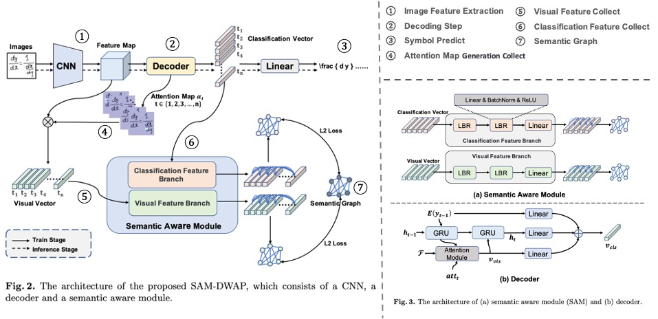

# SAM
## [Semantic Graph Representation Learning for Handwritten Mathematical Expression Recognition (ICDAR 2023)](https://arxiv.org/abs/2308.10493)

This is the official pytorch implementation of [SAM](https://arxiv.org/abs/2308.10493)[ICDAR'2023]. 

>* Zhuang Liu, Ye Yuan, Zhilong ji, Jingfeng Bai and Xiang Bai*

## Pipeline
<p align="left"></p>

## Usage
You need config the config file and run train or inference after.
```bash
python train.py --config config_v2.yaml
```


## Citation
@misc{liu2023semantic,
    title={Semantic Graph Representation Learning for Handwritten Mathematical Expression Recognition},
    author={Zhuang Liu and Ye Yuan and Zhilong Ji and Jingfeng Bai and Xiang Bai},
    year={2023},
    eprint={2308.10493},
    archivePrefix={arXiv},
    primaryClass={cs.CV}
}

## Recommendation

Some other excellent open-sourced HMER algorithms can be found here:

[WAP](https://github.com/JianshuZhang/WAP)[PR'2017]
[DWAP-TD](https://github.com/JianshuZhang/TreeDecoder)[ICML'2020]
[BTTR](https://github.com/Green-Wood/BTTR)[ICDAR'2021]
[ABM](https://github.com/XH-B/ABM)[AAAI'2022]
[SAN](https://github.com/tal-tech/SAN)[CVPR'2022]
[CoMER](https://github.com/Green-Wood/CoMER)[ECCV'2022]
[CAN](https://github.com/LBH1024/CAN)[ECCV'2022]